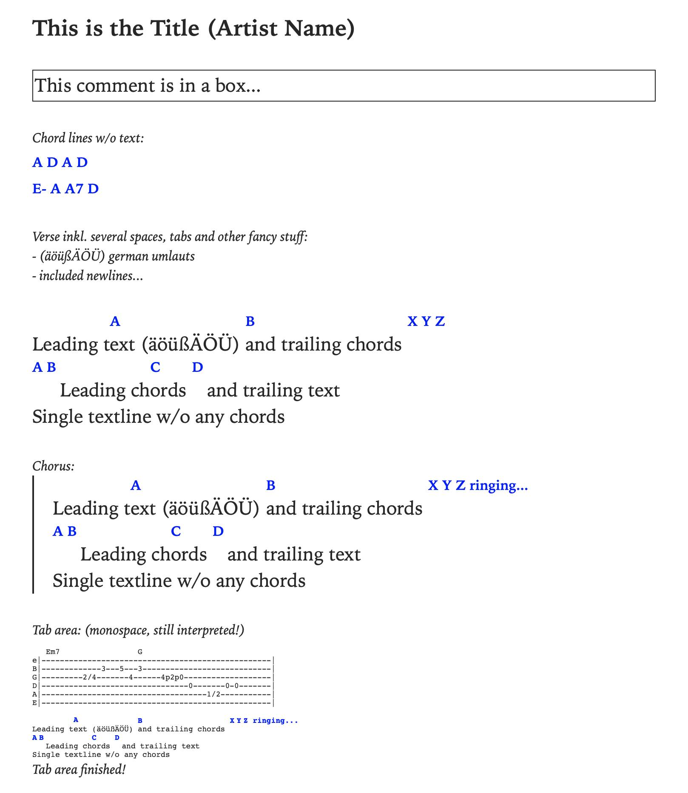

# chordpro-epub
Simple script to create a songbook from a list of chordpro files.



## Installing

Download the latest wheel from the build artifacts, or install with pip
```
$ pip install git+https://github.com/paulfd/chordpro-epub.git
```
PyPI availability might come later.

## Usage

```bash
[user@foo chopro-epub]$ chopro-epub --help
Usage: chopro-epub [OPTIONS] SONG_LIST

  Generate an EPUB songbook from a list of songs.

Arguments:
  SONG_LIST  The path to the file containing the list of songs with one song
             per line.  [required]

Options:
  --output PATH                   The output path for the generated EPUB
                                  songbook.  [default: songbook.epub]
  --css PATH                      The path to a custom CSS file to style the
                                  EPUB.
  --book-title TEXT               The title of the generated EPUB songbook.
                                  [default: Songbook]
  --book-id TEXT                  An identifier for the EPUB songbook.
                                  [default: songbook31415926535]
  --book-author TEXT              The author or creator of the EPUB songbook.
  --wrap-chords / --no-wrap-chords
                                  If True, chords within the song lyrics will
                                  be wrapped in square brackets.  [default:
                                  no-wrap-chords]
  --verbose / --no-verbose        [default: no-verbose]
  --help                          Show this message and exit.
```

Example usage
```bash
$ chopro-epub list.txt --verbose
$ chopro-epub --css custom.css --book-author "Paul Ferrand" --book-title "My Songbook" list.txt
```

## Custom styling

You can use [the default style](chopro_epub/chopro-epub.css) as a basis to customize the output style.

## Contributing

The project is fairly contained. I added [pre-commit hooks](https://pre-commit.com/) that you
can use by running `pre-commit install` in this repository. Any contribution is welcome.

Note that I do not wish to host songs here.

## Acknowledgements

Thanks a lot to [Robert Hoeller](https://github.com/rhh) for the much improved parsing code!
